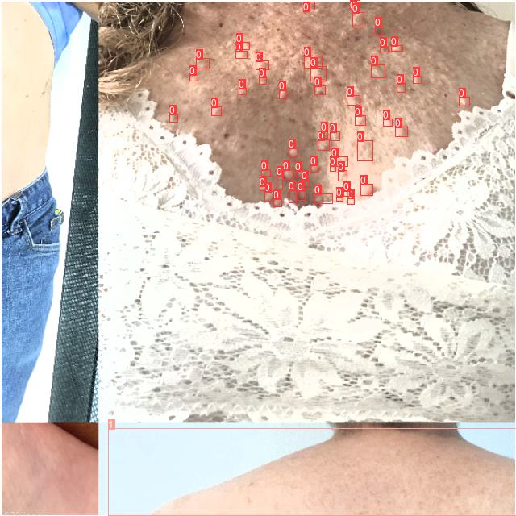
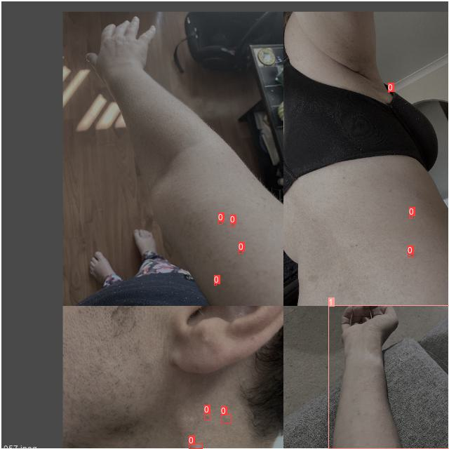
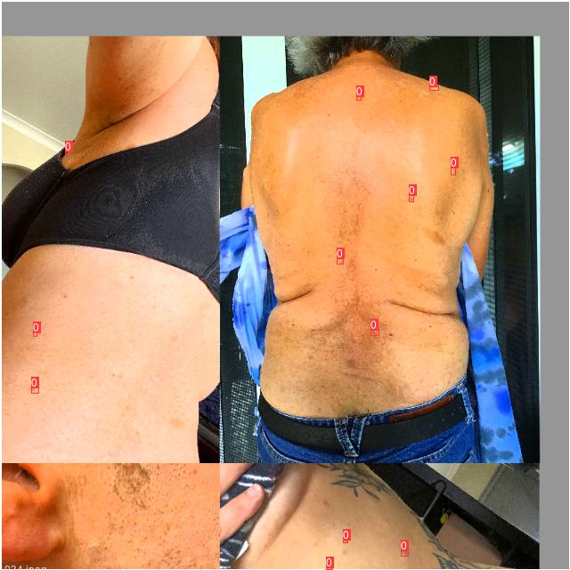
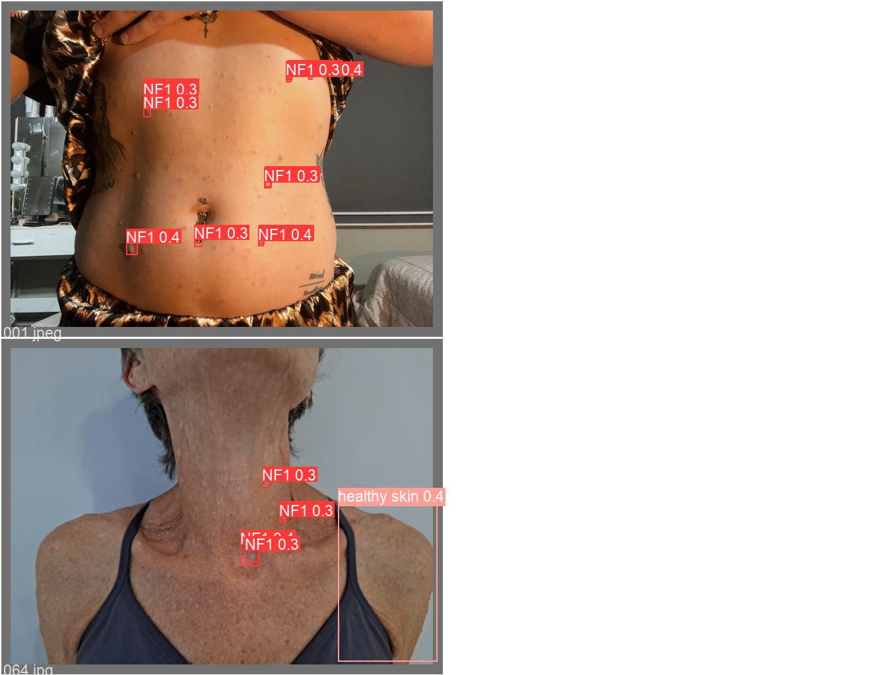
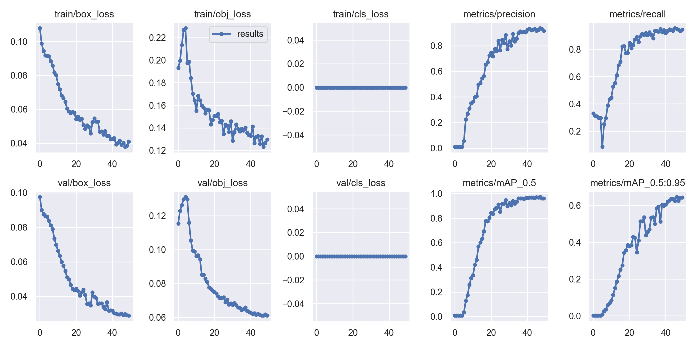

# the-detection-and-classifing-of-NF1


## Introduction


This project is based on yolov5 (https://github.com/ultralytics/yolov5) and transformer's self-attention mechanism as architecture developed project to detect and classify neuroma images. The self-attention mechanism is embedded into the backbone of yolov5 as a way to improve accuracy and inference speed.

### Environment Configuration


The detailed environment configuration is in requirements.txt as follows:

```shell
pip install -r requirements.txt
```


### Data set processing

For data processing, we first label the original image, we choose to use labelme to label the image. We can get the labeled json file, and later we will use .dataset/NF1_data/n2coco.py to convert the labelme json file to json file in coco dataset format. Immediately after that, we will use .dataset/NF1_data/NF1_data.py to convert the json file to text format to conform to yolov5's annotation input format. And then we will divide the dataset into training set and validation set. (This will require the use of  ./dataset/NF1_data/distribution_dataset.py)

### Training module

For training the model:

```shell
python ./code/train.py --data ./dataset/NF1_data/data.yaml --weight ./pretrain.pt
```


#### Self-attention mechanism

I have modified certain code in the backbone section of yolov5 to introduce the self-attention mechanism, here is the code for my modified section:


### Inference module

For inference module:

```shell
python ./code/inference.py
```
Here I have extrapolated one of the images its shown below:


### Analysis of results

What I will show below are the predicted and processed images for each batch during training as follows:

</div>
<div align="center">
    <a href="./">
        
        
        
    </a>
</div>

Below I will show the predicted and actual labeled images for labeling, 
where the left side is the predicted image and the right side is the actual labeled image:

</div>
<div align="center">
    <a href="./">
        
        
    </a>
</div>

The last thing I will show is the training loss function and the line graph of various metrics with the number of training rounds:

<div align="center">
    <a href="./">
        
    </a>
</div>
